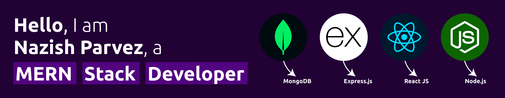
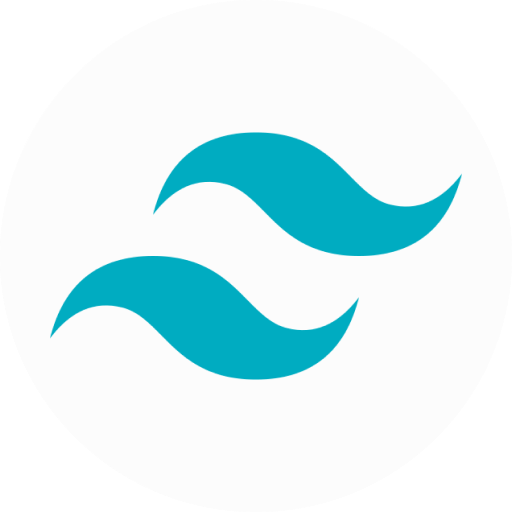

<!-- Banner -->

<!-- About Me -->

<h2>About Me : </h2>

🚀 Aspiring MERN Stack Developer | Computer Science Engineering Graduate 🎓

🌟 Eager to Kickstart my Professional Journey 🌟

Hello! 👋 I am a recent Computer Science Engineering graduate with a passion for crafting innovative solutions using the MERN stack. 💻 I am on the lookout for an entry-level position where I can channel my knowledge and skills into real-world projects, while also expanding my horizons through continuous learning.

My academic background has equipped me with a solid foundation in programming and problem-solving, and I am now eager to translate that knowledge into practical applications. I thrive in dynamic environments and am excited about the prospect of collaborating with talented teams to tackle challenging problems and create impactful solutions.

I am enthusiastic about opportunities that offer room for growth and development, where I can contribute meaningfully to projects that make a difference. I am committed to refining my skills, embracing new technologies, and honing my craft to become a proficient developer.

Let's connect and explore how I can add value to your team and contribute to meaningful projects!

<!-- Technical Skills -->

<h2>Tech Stack : </h2>

<!-- Connect With Me -->

<h2>Connect With Me : </h2>

