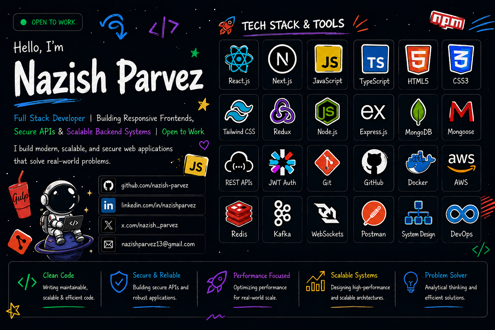
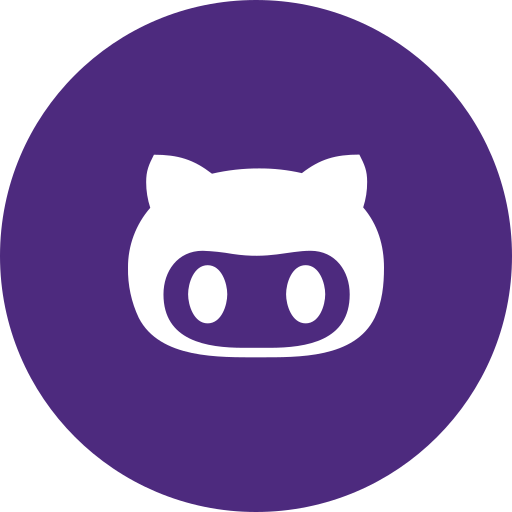

<!-- Banner -->

<!-- About Me -->

<h2>About Me : </h2>

I'm a Full Stack Developer interested in building responsive frontends, secure APIs, and scalable backend systems. I enjoy turning ideas into real-world applications and solving problems through code.

I have hands-on experience with React.js, Next.js, Node.js, Express.js, MongoDB, TypeScript, and the MERN stack, through projects focused on full-stack development, authentication systems, REST APIs, and CRUD operations.

Along with development, I'm continuously learning about system design, backend scalability, DevOps, Docker, cloud technologies, and distributed systems to improve my software engineering skills and build production-ready applications.

I'm interested in: 
• Full Stack Web Development 
• Backend Development & API Design 
• Responsive UI Development 
• Authentication & Security 
• Performance Optimization & Scalability 
• System Design & Modern Software Engineering 

Currently looking for opportunities to learn, contribute, and grow as a Software Engineer / Full Stack Developer while building impactful products.

<!-- Connect With Me -->

<h2>Connect With Me : </h2>

